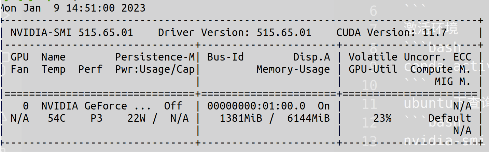

## 1)配置pytorch环境
注意：需要使用pytorch1.6以上
创建环境
```bash
conda create -n pytorch1.6 python=3.8
```
激活环境
```bash
conda activate python=3.8
```
ubuntu下查询cuda版本
```bash
nvidia-smi
```
可以看到对应的CUDA版本为11.7

安装pytorch1.6
```bash
conda install pytorch torchvision cudatoolkit=11.7 -c pytorch
```
克隆项目到本地
```bash
git clone https://github.com/ultralytics/yolov5.git
```
或下载[yolov5版本v3.1](https://github.com/ultralytics/yolov5/releases/tag/v3.1)
## 2)安装所需库
使用清华镜像源：
进入创建的pytorch1.6环境，在yolov5路径下执行：
```bash
pip install -r requirements.txt -i https://pypi.tuna.tsinghua.edu.cn/simple
```
### 3)测试安装
#### 使用detect.py预测
启动pytorch环境在yolov5路径下执行：
```bash
python detect.py --source ./inference/images/ --weights yolov5s.pt --conf 0.4
```
其中:
- source:预测对象文件夹，可以是各种来源。
- weight:指定预训练权重文件
- conf:置信度阈值，置信度小于0.4会被忽略。
权重文件可提前下载，运行时模型会自动从最新的YOLOv5中的release中下载，并将结果保存到runs/detect。
### 4)yolov5目录结构
```xml
yolov5
|	detect.py  # 检测脚本
|	hubconf.py  # PyTorch Hub相关代码
|	LICENSE  # 版权文件
|	README.md  # README markdown文件
|	requirements.txt  # 项目所需的安装包列表
|	sotabench.py  # COCO数据集测试脚本
|	test.py  # 模型测试脚本
|	train.py  # 模型训练脚本
|	tutorial.ipynb  # Jupyter Notebook演示代码
|
├── data
│   ├── coco128.yaml# COCO128数据集配置文件
│   ├── coco.yaml # COCO数据集配置文件
│   ├── GlobalWheat2020.yaml 
│   ├── hyps # 超参数配置文件
│   ├── VOC.yaml # VOC数据集配置文件
│   └── scripts
│       ├── download_weights.sh # 下载weights文件
│       ├── get_coco128.sh # 下载coco128数据集脚本
│       ├── get_coco.sh # 下载coco数据集脚本
│       └── get_imagenet.sh # 下载ImageNet数据集脚本
|
|—— inference
|	└── images  # 示例图片文件夹
|			bus.jpg
|			zidane.jpg
|
|—— models
|	|	common.py  # 模型组件定义代码
|	|	experimental.py  # 实验性质的代码
|	|	export.py  # 模型导出脚本
|	|	yolo.py  # Detect及Model构建代码
|	|	yolov5l.yaml  # yolov5l网络模型配置文件
|	|	yolov5m.yaml  # yolov5m网络模型配置文件
|	|	yolov5s.yaml  # yolov5s网络模型配置文件
|	|	yolov5x.yaml  # yolov5x网络模型配置文件
|	|	__init__.py
|	|
|	└── hub
|			yolov3-spp.yaml
|			yolov5-fpn.yaml
|			yolov5-panet.yaml
|
|—— runs  # 训练结果
|	|—— exp0
|	|	|	events.out.tfevents.1604835533.PC-201807230204.26148.0
|	|	|	hyp.yaml
|	|	|	labels.png
|	|	|	opt.yaml
|	|	|	precision-recall_curve.png
|	|	|	results.png
|	|	|	results.txt
|	|	|	test_batch0_gt.jpg
|	|	|	test_batch0_pred.jpg
|	|	|	train_batch0.jpg
|	|	|	train_batch1.jpg
|	|	|	train_batch2.jpg
|	|	|
|	|	└── weights
|	|			best.pt  # 最好权重
|	|			last.pt  # 最近权重
|—— utils
|	|	activations.py  # 激活函数定义代码
|	|	datasets.py  # Dataset及Dataloader定义代码
|	|	evolve.sh  # 超参数进化命令
|	|	general.py  # 项目通用函数代码
|	|	google_utils.py  # 谷歌云使用相关代码
|	|	torch_utils.py  # 辅助程序代码
|	|	__init__.py
|	|
|	└── google_app_engine
|			additional_requirements.txt
|			app.yaml
|			Dockerfile
|
|—— VOC  # 数据集目录
|	|—— images  # 数据集图片目录
|	|	|—— train  # 训练图片文件夹
|	|	|		000005.jpg
|	|	|		000007.jpg
|	|	|		......	
|	|	|
|	|	└── val  # 验证集图片文件夹			
|	|			000001.jpg	
|	|			......
|	|	
|	└── labels  # 数据集标签目录			
|		|	train.cache  # 保存标签的缓存文件,加快训练
|		|	val.cache
|		|
|		|—— train # 训练集标签文件夹
|		|		000005.txt
|		|		000007.txt
|		|		......
|		|
|		└── val  #测试集标签文件夹
|				000001.txt
|				......
└── weights
      download_weights.sh  # 下载权重文件命令
      yolov5l.pt  # yolov5l权重文件
      yolov5m.pt  # yolov5m权重文件
      yolov5s.mlmodel  # yolov5s权重文件(Core ML格式)
      yolov5s.onnx  # yolov5s权重文件(onnx格式)
      yolov5s.pt  # yolov5s权重文件
      yolov5s.torchscript.pt  # yolov5s权重文件(torchscrip格式)
      yolov5x.pt  # yolov5x权重文件
```